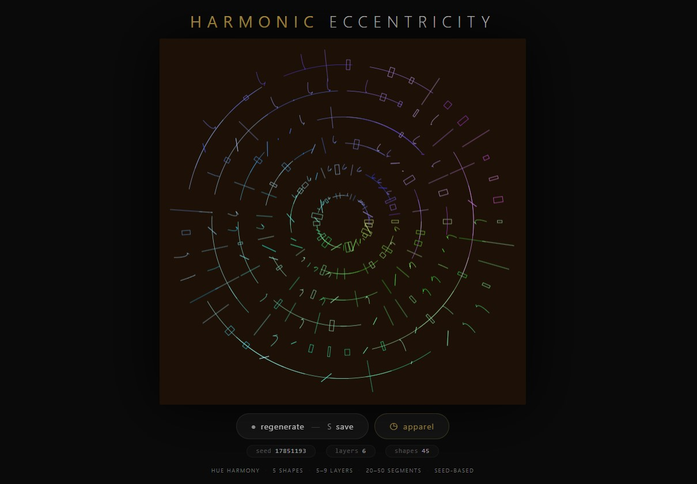
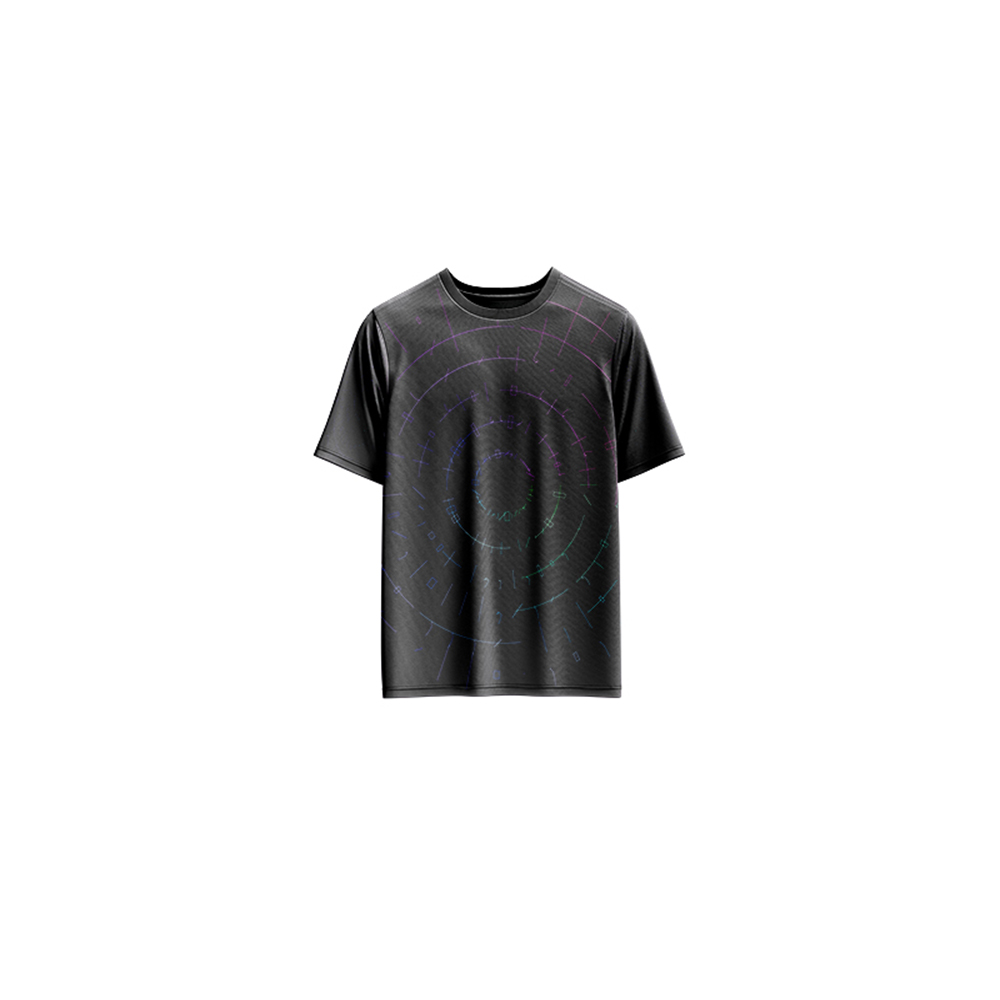

# Harmonic Eccentricity — Generative Art

[](https://reyrove.github.io/Harmonic-Eccentricity-Generative-Art)
[](https://opensource.org/licenses/MIT)

> **Generative hue harmony art.** Each refresh creates a unique radial composition of geometric shapes with harmonious color palettes, dark backgrounds, and organic patterns.

## 🎨 Live Demo

<div align="center">
  <a href="https://reyrove.github.io/Harmonic-Eccentricity-Generative-Art" target="_blank">
    
  </a>
  <br><br>
  <a href="https://reyrove.github.io/Harmonic-Eccentricity-Generative-Art" target="_blank">
    
  </a>
  <br>
  <em>Click the image or button to experience the generative art</em>
</div>

## 👕 Apparel Preview

<div align="center">
  
  <br>
  <em>Harmonic Eccentricity artwork printed on a T-shirt</em>
</div>

## ✨ Features

- **5 Shape Types** — Lines, arcs, triangles, rectangles, and bezier curves
- **Radial Symmetry** — Layered, rotating geometric compositions
- **Harmonic Colors** — HSL color harmony with shifting hues
- **Dark Backgrounds** — Rich, dark color palettes
- **Organic Patterns** — Random shape selection and placement
- **Seed-Based** — Every composition is unique and reproducible via its seed
- **Save & Share** — Download as PNG with seed in filename
- **Apparel Mode** — Preview artwork on a T-shirt mockup
- **Responsive** — Works on desktop, tablet, and mobile
- **Pure JavaScript** — No external dependencies
- **Keyboard Shortcuts**:
  - `R` — Regenerate
  - `S` — Save image
  - `T` — Toggle apparel view

## 🎨 Artwork Details

| Parameter | Range | Description |
|-----------|-------|-------------|
| **Shape Types** | 5 options | Line, Arc, Triangle, Rectangle, Bezier |
| **Layers** | 5–9 | Concentric radial layers |
| **Segments** | 20–50 | Shapes per layer |
| **Background Colors** | 100+ | Dark HSL color palette |
| **Hue Shift** | 0–360 | Harmonic color variation |

## 🎯 Shape Types

| Shape | Description |
|-------|-------------|
| **Line** | Simple radial line segments |
| **Arc** | Curved arc segments |
| **Triangle** | Geometric triangular forms |
| **Rectangle** | Small rectangular marks |
| **Bezier** | Flowing bezier curves |

## 🚀 Quick Start

### Local Development

```bash
# Clone the repository
git clone https://github.com/reyrove/Harmonic-Eccentricity-Generative-Art.git

# Navigate to the directory
cd Harmonic-Eccentricity-Generative-Art

# Open in browser
open index.html
# or use a live server
```

### Deploy to GitHub Pages

1. Push to GitHub
2. Go to Settings → Pages
3. Select branch `main` and root folder
4. Your site will be live at `https://reyrove.github.io/Harmonic-Eccentricity-Generative-Art`

## 🧠 How It Works

The artwork is generated using a deterministic random number generator, seeded by timestamp + random noise. Every refresh:

1. **Setup**:
   - Random dark background from HSL palette
   - 5-9 layers of shapes
   - 20-50 segments per layer
   - Random base hue for color harmony

2. **Shape Generation**:
   - Each segment gets a random shape type
   - Shapes placed radially around center
   - Colors shift harmoniously with position and layer

3. **Rendering**:
   - Dark background
   - Shapes drawn with varying opacity
   - Organic, radial composition

## 📁 File Structure

```
Harmonic-Eccentricity-Generative-Art/
├── index.html                  # Main application (all-in-one)
├── Harmonic-Eccentricity.jpg   # T-shirt mockup image
├── fav.svg                     # Favicon
├── demo-screenshot.jpg         # Website demo screenshot
├── README.md                   # This file
└── LICENSE                     # MIT License
```

## 🛠️ Tech Stack

- **Pure Vanilla HTML/CSS/JS** — No dependencies
- **Canvas API** — 2D rendering
- **HSL Color Model** — Color generation
- **CSS Flexbox/Grid** — Responsive layout
- **GitHub Pages** — Hosting

## 🎯 Interactive Controls

| Action | Keyboard | Button |
|--------|----------|--------|
| Regenerate | `R` | Click "regenerate" |
| Save Image | `S` | Click "regenerate" |
| Toggle Apparel | `T` | Click "apparel" |

## 🎨 The Creative Process

### Harmonic Colors
Colors are generated using HSL (Hue, Saturation, Lightness) with harmonious shifts:
- Base hue determines the overall color direction
- Each shape shifts hue based on angle and layer
- Saturation and lightness vary for depth

### Radial Composition
Shapes are arranged in concentric layers:
- Each layer has a different radius
- Shapes rotate around the center
- Random shape selection creates organic variety

### Dark Backgrounds
Rich, dark backgrounds provide contrast and make the colorful shapes pop, creating a dramatic and elegant aesthetic.

## 📱 Responsive Design

The application automatically adapts to:
- Desktop screens
- Tablets
- Mobile phones
- Landscape orientation
- Various aspect ratios

## 🤝 Contributing

Contributions are welcome! Feel free to:
- Fork the repository
- Create a feature branch
- Submit a pull request

### Ideas for Contributions:
- New shape types
- Additional color palettes
- Animation features
- Interactive controls
- Performance optimizations

## 📄 License

MIT License — see [LICENSE](LICENSE) file for details.

## 🙏 Acknowledgments

- Inspired by hue harmony and generative art
- Pure JavaScript implementation
- Special thanks to the creative coding community

---

**Built with ❤️ and harmonic eccentricity**